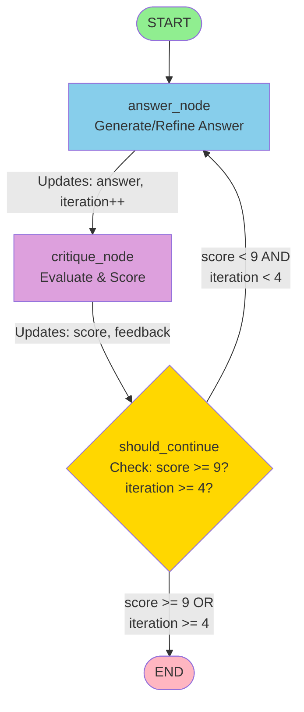
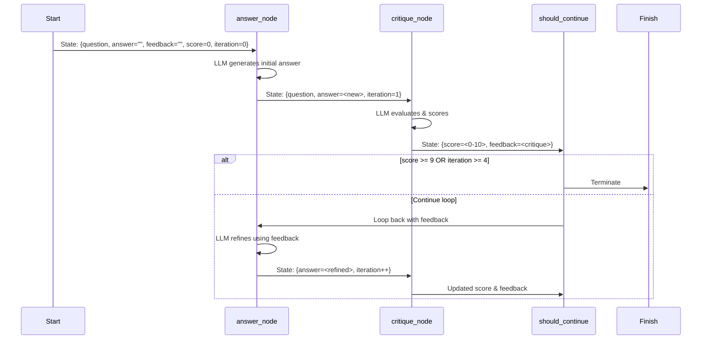
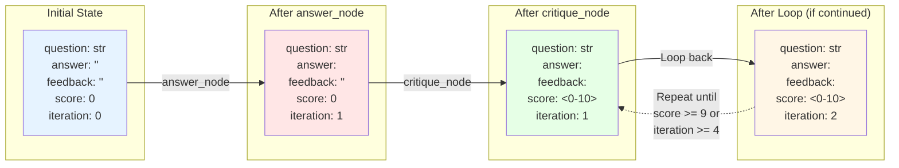

# Two-Agent Flow: Answer Generation with Iterative Refinement

## Overview

This script implements a **self-improving answer generation system** using LangGraph. It uses two LLM-powered agents that work together in a feedback loop to iteratively refine an answer until it meets quality criteria.

## Conceptual Architecture

The system follows a **generate-critique-refine** pattern:

1. **Answer Agent**: Generates or refines an answer based on the question and previous feedback
2. **Critique Agent**: Evaluates the answer against specific criteria and provides scoring/feedback
3. **Loop Control**: Decides whether to continue refining or terminate based on score thresholds and iteration limits

This creates an autonomous quality improvement cycle where the answer gets better with each iteration.

## Data Flow

### State Schema (`LoopState`)

The entire graph operates on a shared state object that persists across nodes:

```python
{
    "question": str,      # The original question to answer
    "answer": str,        # Current version of the answer (updated each iteration)
    "feedback": str,      # Critique feedback from previous iteration
    "score": int,         # Quality score (0-10) from critique agent
    "iteration": int      # Number of refinement cycles completed
}
```

### Graph Flow Diagram



### State Flow Sequence



### Data Structure Evolution



### Textual Flow Description

```
START
  ↓
[answer_node] → Generates/refines answer using:
                - Original question
                - Previous answer (if exists)
                - Previous feedback (if exists)
                → Updates: answer, iteration++
  ↓
[critique_node] → Evaluates answer against 4 criteria:
                  - Under 140 words
                  - Includes one numeric example
                  - Lists compounding frequencies (yearly, monthly, daily)
                  - States that more frequent compounding grows faster
                  → Updates: score (0-10), feedback
  ↓
[should_continue] → Conditional logic:
                    - If score >= 9: END ✓
                    - If iteration >= 4: END (max iterations)
                    - Otherwise: Loop back to answer_node
```

### Data Transformations

1. **Initial State** → **answer_node**:
   - Input: `{question, answer="", feedback="", score=0, iteration=0}`
   - Process: LLM generates initial answer
   - Output: `{question, answer=<new>, feedback="", score=0, iteration=1}`

2. **answer_node** → **critique_node**:
   - Input: State with new answer
   - Process: LLM evaluates answer, extracts score and feedback
   - Output: `{question, answer=<same>, feedback=<critique>, score=<0-10>, iteration=<same>}`

3. **critique_node** → **should_continue**:
   - Checks `score` and `iteration` fields
   - Routes back to `answer_node` if improvement needed, or to `END` if done

4. **Loop iterations**:
   - Each cycle: `answer_node` receives previous `feedback` and `answer`
   - LLM uses feedback to improve the answer
   - `iteration` increments each pass through `answer_node`

## Technical Details

### Nodes

#### `answer_node(state: LoopState) -> LoopState`
- **Purpose**: Generate or refine the answer
- **Inputs**: Uses `question`, `answer` (previous), `feedback` (previous)
- **Process**: Constructs prompt asking LLM to improve answer based on feedback
- **Outputs**: Updates `answer` and increments `iteration`

#### `critique_node(state: LoopState) -> LoopState`
- **Purpose**: Evaluate answer quality
- **Inputs**: Uses `question` and `answer`
- **Process**: 
  - LLM checks 4 specific criteria
  - Parses response to extract `SCORE:` and `FEEDBACK:` lines
  - Maps criteria met → score (10/8/6/4/2)
- **Outputs**: Updates `score` and `feedback`

#### `should_continue(state: LoopState) -> Literal["answer", END]`
- **Purpose**: Control loop termination
- **Logic**:
  - `score >= 9` → `END` (quality threshold met)
  - `iteration >= 4` → `END` (max iterations reached)
  - Otherwise → `"answer"` (continue loop)

### Termination Conditions

- **Success**: Score reaches 9 or higher (quality threshold)
- **Timeout**: 4 iterations completed (prevents infinite loops)

## Example Execution Flow

```
Iteration 1:
  answer_node: Generates initial answer
  critique_node: Scores 6 (2 criteria met)
  → Loop continues

Iteration 2:
  answer_node: Refines answer using feedback
  critique_node: Scores 8 (3 criteria met)
  → Loop continues

Iteration 3:
  answer_node: Further refines answer
  critique_node: Scores 10 (all criteria met)
  → END (success!)
```

## Dependencies

- `langgraph`: Graph orchestration framework
- `langchain_openai`: OpenAI LLM integration
- Python 3.8+ with type hints support

## Usage

```bash
python two_agent_flow.py
```

The script will:
1. Initialize with a question about compound interest
2. Run the refinement loop
3. Print final answer, score, feedback, and iteration count

## Key Design Patterns

- **Stateful Graph**: Shared state object passed between nodes
- **Conditional Edges**: Dynamic routing based on state evaluation
- **Iterative Refinement**: Feedback loop improves output quality
- **Autonomous Quality Control**: System terminates when quality threshold met

