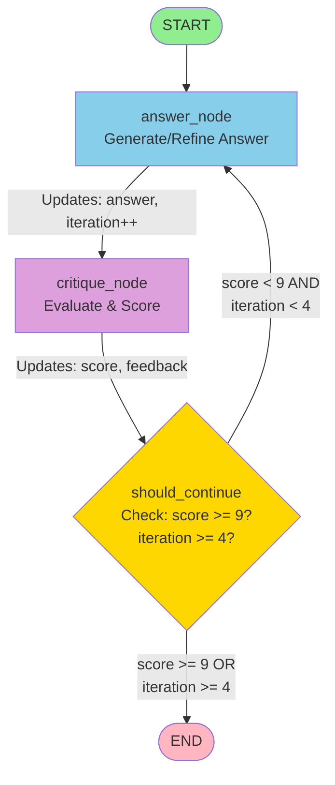
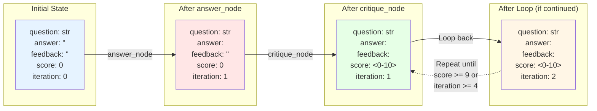

# Two-Agent Flow Diagram



## State Flow Through Nodes

```mermaid
sequenceDiagram
    participant Start
    participant Answer as answer_node
    participant Critique as critique_node
    participant Decision as should_continue
    participant End
    
    Start->>Answer: State: {question, answer="", feedback="", score=0, iteration=0}
    Answer->>Answer: LLM generates initial answer
    Answer->>Critique: State: {question, answer=<new>, iteration=1}
    Critique->>Critique: LLM evaluates & scores
    Critique->>Decision: State: {score=<0-10>, feedback=<critique>}
    
    alt score >= 9 OR iteration >= 4
        Decision->>End: Terminate
    else Continue loop
        Decision->>Answer: Loop back with feedback
        Answer->>Answer: LLM refines using feedback
        Answer->>Critique: State: {answer=<refined>, iteration++}
        Critique->>Decision: Updated score & feedback
    end
```

## Data Structure Evolution



